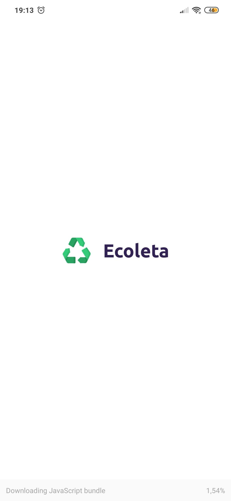
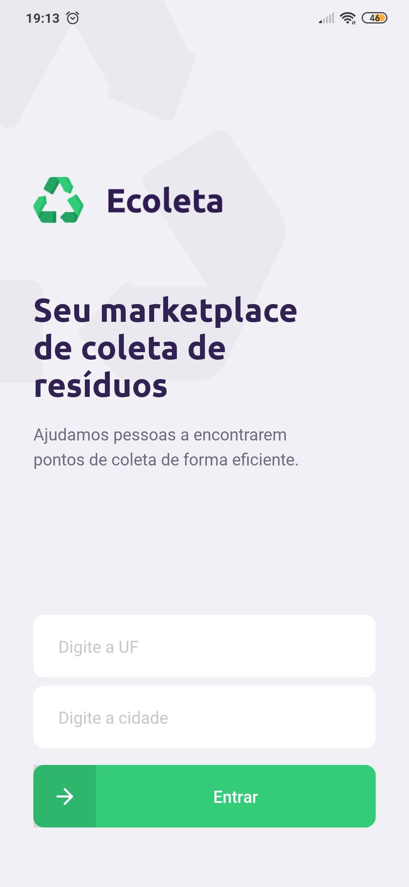
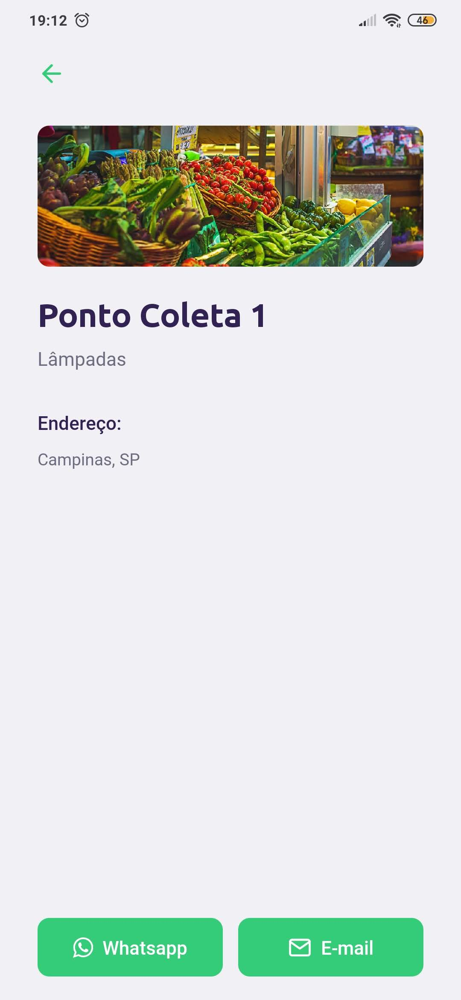

<h4 align="center">
    <br/>
    <b>Seu marketplace de coleta de resíduos.</b><br/>
    <b>Recicle! Ajude o meio ambiente!</b> ♻️ 
</h4>

[](https://github.com/ederlopesgoncalves/be-the-hero)
[](https://github.com/ederlopesgoncalves/be-the-hero)
[](https://github.com/ederlopesgoncalves/be-the-hero)

<h2 align="center">
  🚀 Next Level Week 1
</h2>

## 💻 Projeto

O **Ecoleta** é uma aplicação Web e Mobile para ajudar pessoas a encontrarem pontos de coleta para reciclagem de forma eficiente. Assim solucionando um grande problema recorrente que é o descarte inadequado do lixo, facilitando o processo de recliclagem e reutilização.

Essa aplicação foi construída na trilha <strong>Booster</strong> da <strong>Next Level Week</strong> distribuída pela [Rocketseat](https://rocketseat.com.br/). A ideia de criar uma aplicação voltada ao meio ambiente surgiu da coincidência da data do curso e a data da <strong>semana do meio ambiente</strong>

<p align="center">
  &nbsp;&nbsp;&nbsp;|&nbsp;&nbsp;&nbsp; 
  <a href="#rocket-tecnologias">Tecnologias</a>&nbsp;&nbsp;&nbsp;|&nbsp;&nbsp;&nbsp;
  <a href="#-projeto">Projeto</a>&nbsp;&nbsp;&nbsp;|&nbsp;&nbsp;&nbsp;
</p>

## :camera: Veja:

### Backend
[](https://insomnia.rest/run/?label=Ecoleta&uri=https%3A%2F%2Fraw.githubusercontent.com%2Federlopesgoncalves%2Fecoleta%2Fmaster%2F.github%2FInsomnia_ecoleta_export.json)

### Frontend
<h1 align="center">
    
    
</h1>

### Mobile
<h1 align="center">
    
    
    
    
</h1>

## :rocket: Tecnologias

Esse projeto foi desenvolvido com as seguintes tecnologias:

- [TypeScript](https://www.typescriptlang.org/)
- [Node.js](https://nodejs.org/en/)
- [ReactJS](https://reactjs.org)
- [React Native](https://facebook.github.io/react-native/)
- [Expo](https://expo.io/)

Extras:

- API: **[IBGE API][ibge_api]** &rarr; **<kbd>[API de UFs][ibge_api_ufs]</kbd>**, **<kbd>[API de Municípios][ibge_api_municipios]</kbd>** 
- Maps: **[Leaflet][leaflet]**
- Editor: **[Visual Studio Code][vscode]** &rarr; Extensions: **<kbd>[SQLite][vscode_sqlite_extension]</kbd>**
- Markdown: **[StackEdit][stackedit]**, **<kbd>[Markdown Emoji][markdown_emoji]</kbd>**
- Commit Conventional: **[Commitlint][commitlint]**
- Teste de API: **[Insomnia][insomnia]**
- Ícones: **[Feather Icons][feather_icons]**, **[Font Awesome][font_awesome]**
- Fontes: **[Ubuntu][font_ubuntu]**, **[Roboto][font_roboto]**

### :fire: Como usar

## Instalar dependências
```bash
npm install
```
## Criar Database
# Instanciando o banco de dados:
```bash
npm run knex:migrate
```
# Povoando o banco de dados (seeds):
```bash
npm run knex:seed
```
## Iniciar Server
```bash
npm run dev
```
## Iniciar Web
```bash
npm start
```
## Iniciar Mobile
```bash
npm start
```