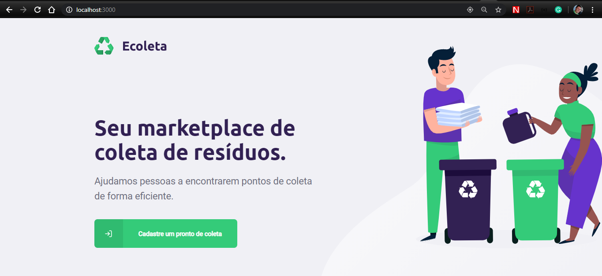
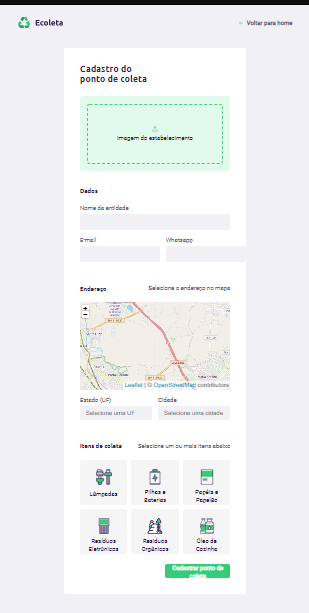
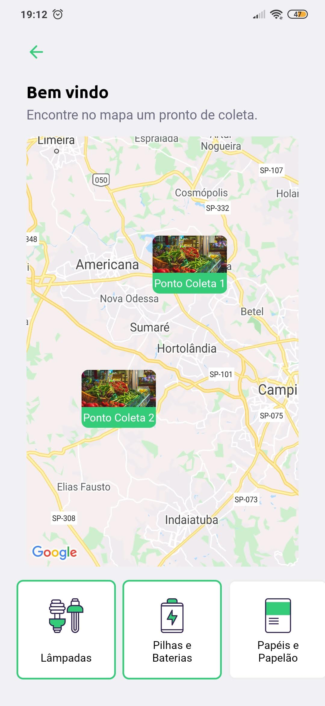

<h4 align="center">
    <br/>
    <b>Seu marketplace de coleta de resíduos.</b><br/>
    <b>Recicle! Ajude o meio ambiente!</b> ♻️ 
</h4>

[](https://github.com/ederlopesgoncalves/ecoleta)
[](https://github.com/ederlopesgoncalves/ecoleta)
[](https://github.com/ederlopesgoncalves/ecoleta)

<h2 align="center">
  🚀 Next Level Week 1
</h2>

## 💻 Projeto

O **Ecoleta** é uma aplicação Web e Mobile para ajudar pessoas a encontrarem pontos de coleta para reciclagem de forma eficiente. Assim solucionando um grande problema recorrente que é o descarte inadequado do lixo, facilitando o processo de recliclagem e reutilização.

Essa aplicação foi construída na trilha <strong>Booster</strong> da <strong>Next Level Week</strong> distribuída pela [Rocketseat](https://rocketseat.com.br/). A ideia de criar uma aplicação voltada ao meio ambiente surgiu da coincidência da data do curso e a data da <strong>semana do meio ambiente</strong>

## :camera: Veja:

### Backend
[](https://insomnia.rest/run/?label=Ecoleta&uri=https%3A%2F%2Fraw.githubusercontent.com%2Federlopesgoncalves%2Fecoleta%2Fmaster%2F.github%2FInsomnia_ecoleta_export.json)

### Frontend
<h1 align="center">
    
    
</h1>

### Mobile
<h1 align="center">
    
    
    
    
</h1>

## :rocket: Tecnologias

Esse projeto foi desenvolvido com as seguintes tecnologias:

- [TypeScript](https://www.typescriptlang.org/)
- [Node.js](https://nodejs.org/en/)
- [ReactJS](https://reactjs.org)
- [React Native](https://facebook.github.io/react-native/)
- [Expo](https://expo.io/)

## Extras:

- API: **[IBGE API][ibge_api]** &rarr; **<kbd>[API de UFs][ibge_api_ufs]</kbd>**, **<kbd>[API de Municípios][ibge_api_municipios]</kbd>** 
- Maps: **[Leaflet][leaflet]**
- Editor: **[Visual Studio Code][vscode]** &rarr; Extensions: **<kbd>[SQLite][vscode_sqlite_extension]</kbd>**
- Markdown: **[StackEdit][stackedit]**, **<kbd>[Markdown Emoji][markdown_emoji]</kbd>**
- Commit Conventional: **[Commitlint][commitlint]**
- Teste de API: **[Insomnia][insomnia]**
- Ícones: **[Feather Icons][feather_icons]**, **[Font Awesome][font_awesome]**
- Fontes: **[Ubuntu][font_ubuntu]**, **[Roboto][font_roboto]**

## :fire: Como usar

## Instalar dependências
```bash
npm install
```
## Criar Database
```bash
# Instanciando o banco de dados:
npm run knex:migrate

# Povoando o banco de dados (seeds):
npm run knex:seed
```
## Iniciar Server
```bash
npm run dev
```
## Iniciar Web
```bash
npm start
```
## Iniciar Mobile
```bash
npm start
```


<!-- Techs -->
[react]: https://reactjs.org/
[typescript]: https://www.typescriptlang.org/
[node]: https://nodejs.org/en/
[leaflet]: https://react-leaflet.js.org/en/
[ibge_api]: https://servicodados.ibge.gov.br/api/docs/localidades?versao=1
[ibge_api_ufs]: https://servicodados.ibge.gov.br/api/docs/localidades?versao=1#api-UFs-estadosGet
[ibge_api_municipios]: https://servicodados.ibge.gov.br/api/docs/localidades?versao=1#api-Municipios-estadosUFMunicipiosGet
[vscode]: https://code.visualstudio.com/
[react_native]: http://www.reactnative.com/
[stackedit]: https://stackedit.io
[vscode_sqlite_extension]: https://marketplace.visualstudio.com/items?itemName=alexcvzz.vscode-sqlite
[markdown_emoji]: https://gist.github.com/rxaviers/7360908
[commitlint]: https://github.com/conventional-changelog/commitlint
[express]: https://expressjs.com/
[cors]: https://expressjs.com/en/resources/middleware/cors.html
[knex]: http://knexjs.org/
[sqlite3]: https://github.com/mapbox/node-sqlite3
[tsnode]: https://github.com/TypeStrong/ts-node
[feather_icons]: https://feathericons.com/
[font_awesome]: https://github.com/FortAwesome/Font-Awesome
[insomnia]: https://insomnia.rest/
[react_leaflet]: https://react-leaflet.js.org/
[react_router_dom]: https://github.com/ReactTraining/react-router/tree/master/packages/react-router-dom
[react_icons]: https://react-icons.github.io/react-icons/
[axios]: https://github.com/axios/axios
[expo]: https://expo.io/
[expo_google_fonts]: https://github.com/expo/google-fonts
[react_navigation]: https://reactnavigation.org/
[react_native_maps]: https://github.com/react-native-community/react-native-maps
[expo_constants]: https://docs.expo.io/versions/latest/sdk/constants/
[react_native_svg]: https://github.com/react-native-community/react-native-svg
[expo_location]: https://docs.expo.io/versions/latest/sdk/location/
[expo_mail_composer]: https://docs.expo.io/versions/latest/sdk/mail-composer/
[font_roboto]: https://fonts.google.com/specimen/Roboto
[font_ubuntu]: https://fonts.google.com/specimen/Ubuntu
